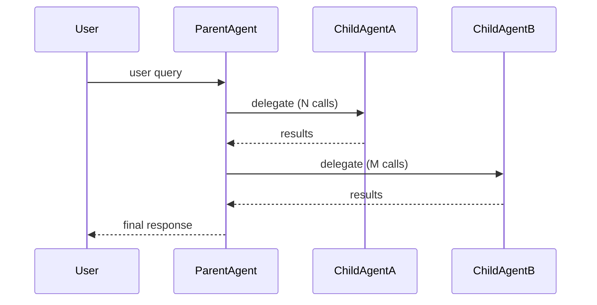
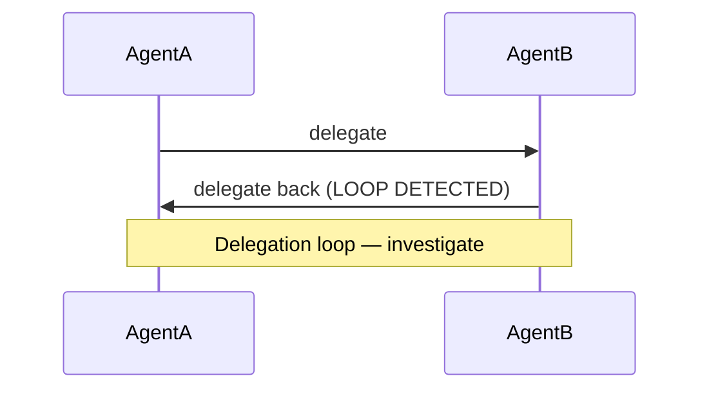

# Mermaid Template for Agent Delegation

When rendering agent delegation results, use this `sequenceDiagram` template.
Replace participant names and messages with actual query results.

## Rules

- Use `-->>` (dashed) for return arrows
- Include call counts from query results in the message labels
- If a delegation loop is detected (A->B->A), add a note:

