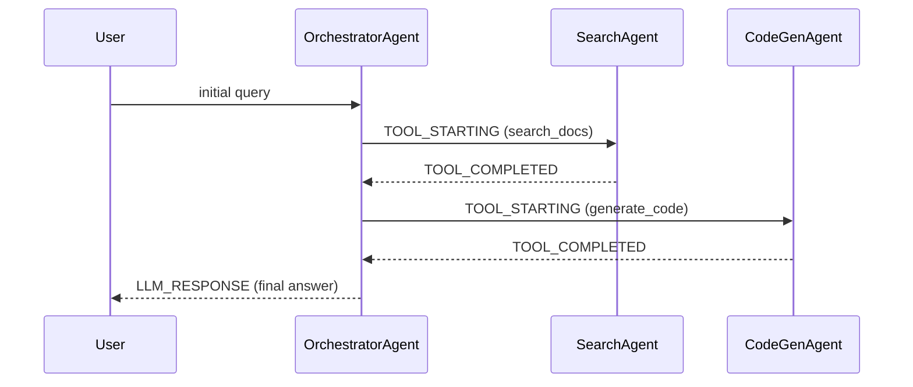

# Examples: User Prompt to Execution

## Example 1: "What's the error rate for my agents this week?"

**Dry-run** (bind `@start`/`@end` via flags, not string interpolation):
```bash
python scripts/run_bq.py --dry-run \
  --start 2026-04-09 --end 2026-04-16 \
  "SELECT COUNT(*) AS total_events, COUNTIF(status = 'ERROR') AS errors, ROUND(COUNTIF(status = 'ERROR') / COUNT(*) * 100, 2) AS error_rate_pct, COUNT(DISTINCT session_id) AS sessions, COUNT(DISTINCT agent) AS agents FROM \`{PROJECT}.{DATASET}.{TABLE}\` WHERE timestamp BETWEEN @start AND @end"
```
Output: `{"dry_run": true, "total_bytes_processed": 312475648, "human_readable": "298.00 MB", "exceeds_limit": false}`

**Execute survey** (under limit, same flags):
```bash
python scripts/run_bq.py --start 2026-04-09 --end 2026-04-16 "..."
```
Output: `{"total_events": 7234, "errors": 231, "error_rate_pct": 3.19, "sessions": 45, "agents": 12}`

**Present:** "7,234 events | 3.19% error rate | 45 sessions | 12 agents over the last 7 days"

**Filter — top 3 error contributors** (use `errors` CTE):

| Agent | Failures | % of Errors |
|-------|----------|------------|
| search_agent | 142 | 61.5% |
| code_gen_agent | 53 | 22.9% |
| summary_agent | 21 | 9.1% |

**Deep dive:** Extract one search_agent failure trace.

**Diagnose:** "This matches pattern: **tool failures on one tool_origin only**. 61.5% of errors come from search_agent. Next step: `tool_calls` CTE grouped by `tool_origin, tool_name`."

---

## Example 2: "Compare model performance over the last month"

**Dry-run** the model comparison query, then execute.

**Present as markdown table sorted by latency descending** (output rule):

| model_id | calls | error_rate | avg_tokens | avg_latency_ms | p95_latency_ms | avg_ttft_ms |
|----------|-------|-----------|------------|---------------|---------------|-------------|
| gemini-1.5-pro | 1,203 | 4.2% | 2,847 | 3,241 | 8,102 | 892 |
| gemini-2.0-flash | 4,891 | 1.1% | 1,523 | 847 | 2,103 | 210 |
| gemini-1.5-flash | 2,340 | 0.9% | 1,102 | 623 | 1,544 | 185 |

**Diagnose:** "This matches pattern: **error_rate spikes on one model_id**. gemini-1.5-pro has 4x higher latency and error rate. Next step: compare error messages between pro and flash."

---

## Example 3: "Show me agent delegation flows for trace abc123"

**Dry-run** the agent_tree query scoped to `trace_id = 'abc123'` (pass
`--trace-id abc123` and an `--start`/`--end` window that brackets the
trace, so partition pruning still applies), then execute.

**Render as Mermaid sequenceDiagram** (output rule for delegation):



**Diagnose:** "Clean linear delegation: Orchestrator -> Search -> CodeGen. No loops detected."
